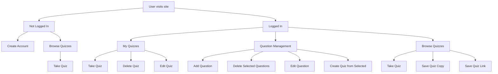

## What is this project?

This project uses a combination of [Phoenix](https://www.phoenixframework.org/) and [React](https://react.dev/) with [TypeScript](https://www.typescriptlang.org/) to build a quiz application, allowing users to easily create their own quizzes.

On the (unordered) roadmap for this project are the following features:
- Quizzes that users can share with other users
- A questions list, from which a user can select a handful of questions and create a quiz from

## Planned User Flow

## Current project stage

Active development

## Links

[Jira](https://ethbruton.atlassian.net/jira/software/projects/ECS/boards/1)
[Figma](https://www.figma.com/design/HffsrBBXC7zmGKKKqJ6LhR/PhoenixQuiz?node-id=1-3&p=f&t=z3Rdhq7Hx9FO0WA7-0)
