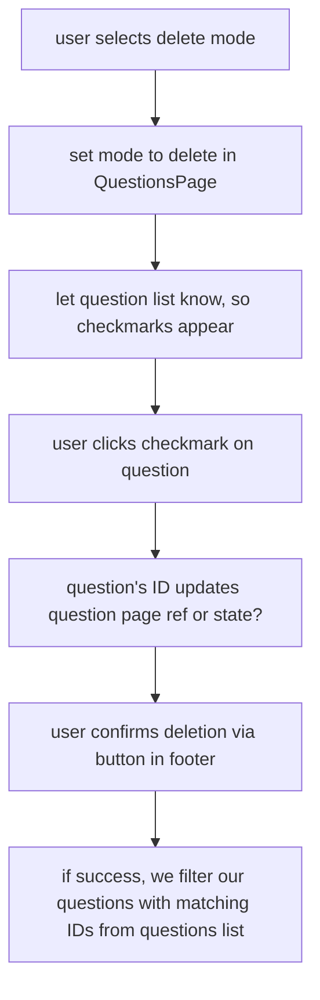

```mermaid
flowchart TD
    A[user selects delete mode] --> B[set mode to delete in QuestionsPage]
    B --> C[let question list know, so checkmarks appear]
    C --> D[user clicks checkmark on question]
    D --> E[question's ID updates question page ref or state?]
    E --> F[user confirms deletion via button in footer]
    F --> G[if success, we filter our questions with matching IDs from questions list]
```